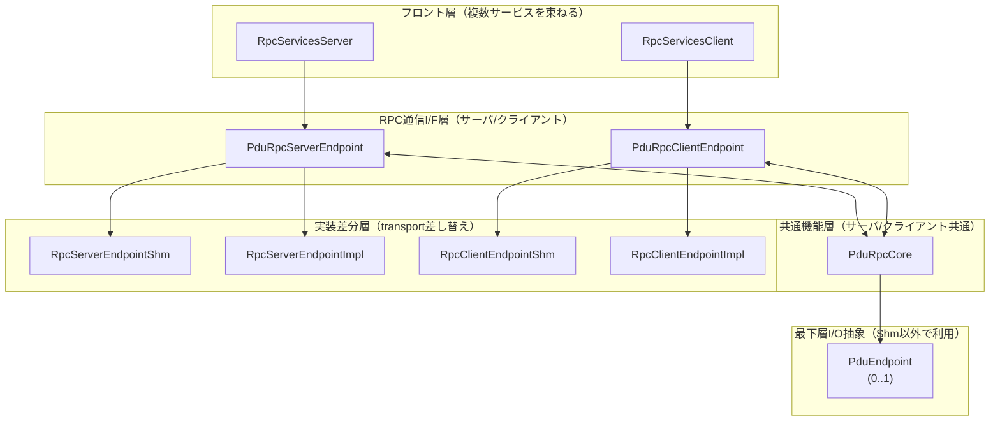

# hakoniwa-pdu-rpc

# 1) アーキテクチャ図

# 2) コンポーネント責務（README用の箇条書き）

## RpcServicesServer / RpcServicesClient（フロント）

- 複数RPCサービスを束ねるフロント（サービス名→ハンドラのルーティング）
- アプリに提供するAPIの入口
- 低レベルの通信方式やPDUを意識させない
- （将来拡張）サービス登録・可観測性（ログ/メトリクス）をここに集約可能

## PduRpcServerEndpoint / PduRpcClientEndpoint（RPC通信I/F）

- サーバ側/クライアント側の RPC通信インタフェース
- poll()/recv()/send() 等の RPC動作に必要な最小の操作を提供
- transport差分（SHM vs PDU/TCP等）を上位に漏らさない
- C++では原則 poll駆動/FSM で成立（Blocking/Immediate分割を不要にしやすい）

## PduRpcCore（共通機能：サーバ/クライアント共通）

- サーバ/クライアント共通の意味論を持つ中心
- 代表的な責務：
  - rpc_id（request_id）の生成・相関管理（req/resの対応）
  - timeout/deadline（期限管理）
  - 進捗/状態（必要なら：BUSY/IN_PROGRESS/DONE/ERROR 等）
  - 冪等性（同一rpc_idの再送が来ても破綻しない設計）
- 通信はしない（I/Oを持たない）
  - → transport依存を排除し、SHM/PDU/TCPで再利用できる

## RpcServerEndpointShm / RpcClientEndpointShm（共有メモリ実装）

- 共有メモリベース（既存資産）でRPCを成立させる実装
- 既存の **SHM版サンプル実装（poll→get_request→reply）**を流用可能
- cancel処理・状態遷移の設計（過去資料のFSM/シーケンス）を活用できる

## RpcServerEndpointImpl / RpcClientEndpointImpl（非SHM実装：PDU/TCPなど）

- 共有メモリ以外の実装（TCP/WS/Zenoh等）をここに閉じ込める
- “プロトコルを新規に作らない”方針の場合：
- 既存 箱庭PDUエンドポイントを「TCP通信の道具」として利用
- 追加の握手やrole判別などを最小化（必要ならRegister 1本で済ませる）
- 頻発するRuntimeDelegationを想定し、非同期待ち（future）を自然に組み込める

## PduEndpoint（最下層I/O抽象：0..1）

hakoniwa-pdu-endpoint を利用して PDUの送受信を行う抽象層

- PDUの publish/subscribe を行う 最下層I/O抽象
- Rpcを知らない / request/responseを知らない / PDUを送るだけ
- 注意：SHM以外の場合のみ利用（0..1 の多重度）
- これを置くことで、RPC層は transport を“道具”として扱える

## 3) これまで議論して確定した設計ポイント（全整理）
### A. gRPCを採用しない理由（意思決定）

- gRPCは バージョン不整合・ビルド地獄に再び巻き込まれるリスクが高い
- mac/win/linux で “パッケージインストールで完結” を狙うと、gRPCは障害になりやすい
- 箱庭はPDU中心の世界観なので、箱庭特化RPCの方が自然で、保守性が高い

### B. “表APIは共有メモリ版に合わせる”

- 既存の共有メモリ版（C++サンプル）の利用体験：
- poll() → get_request() → normal_reply()（必要なら cancel）
- この 外形を変えないことで、移植コストと利用者コストが最小

### C. Blocking/Async（待ち方）の整理：futureで統一

- 頻発するRuntimeDelegationでは、同期呼び出しの直列化がボトルネックになり得る
- 解として、クライアントAPIを future（非同期）で統一し、
- waitするタイミングは利用側に委ねる
- ライブラリ内部はマルチスレッド（I/Oスレッド等）で応答を完了させる
- ただし、プロトコル実装コストが増える場合は、
- “最小コストで確実に動く” を優先して構成を縮退させる（下記）

### D. Control Plane / Data Plane の分離

- 制御・重要データ（コンテキスト/実行権）＝信頼性の高い経路（TCP/RPC）
- 通常PDU（大量データ）＝UDP/SHMなど高速経路 + epochで掃除
- これにより、設計がシンプルかつ堅牢になる
- ブリッジは“エポック番人”に徹する
- コンテキストは到達保証のある経路で扱う

### E. RuntimeArbiter（司令塔）まわりの現実解（開発コスト優先）

- 理想：RuntimeArbiterをサーバにして常時接続・即時配送（ms精度）
- ただし、双方向RPC/握手/role判別等の プロトコル実装コストが重い
- 今回の制約（開発コストを出せない）では、
- 各コンポーネント（Asset/Bridge等）をTCPサーバ

- RuntimeArbiterはTCPクライアントが最も健全（ポートは10個程度で許容）
- 対象コンポーネントは 定義ファイルで集約管理し、discoveryを捨てて簡素化

### F. イベント通知の扱い（Conductor周辺）

- “イベント通知”をTCP pub/subで作るのは実装が重い
- 1秒程度の粒度でよいものは pollingで良い
- Conductorに関しては、イベントを“通知”ではなく
- “開始要求の同期点”として扱い、RPC＋pollで成立させる

### G. 既存資産の最大活用

- RPCサービスAPI（PDU）はすでにROSIDL定義済み → 流用
- 追加するのは主に：
  - RuntimeDelegation の移植
  - ConductorのgRPC API部分の移植（箱庭RPCへ）
  - 共有メモリ版の状態設計/シーケンス（過去資料）は、FSM/キャンセル仕様などに活用

## 4) “設計意図”サマリ

- 箱庭PDU-RPCは 通信方式に依存しないRPCの枠組みを提供する
- 共有メモリ（SHM）版の実績あるAPI外形（poll→request→reply）を維持し、transport差分はEndpoint実装に閉じ込める
- 共通意味論（相関ID、timeout、冪等性等）は PduRpcCore に集約し、通信I/Oは PduEndpoint（0..1）に限定する
- gRPCのビルド/バージョン地獄を回避し、箱庭に最適化したRPCをC++で提供する
