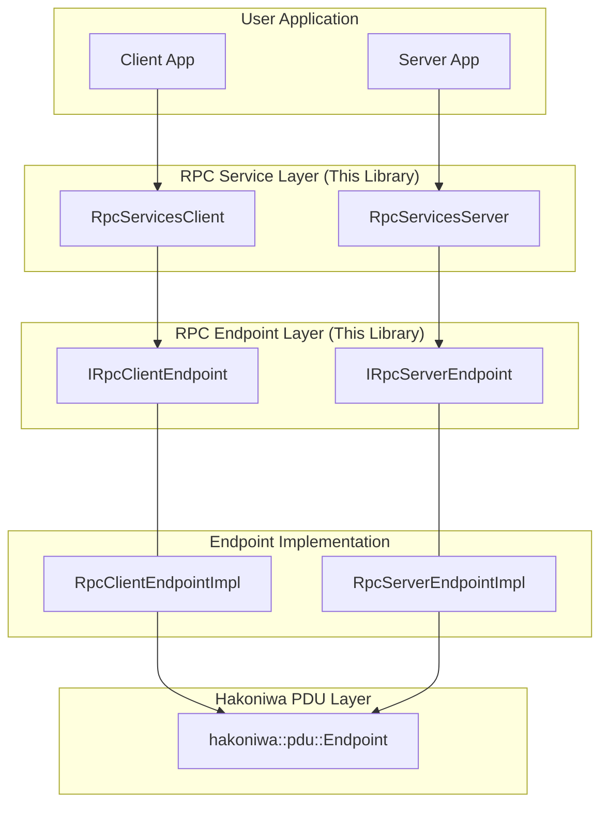

# Hakoniwa PDU-RPC

`hakoniwa-pdu-rpc` is a C++ library that provides a framework for remote procedure calls (RPC) built on Hakoniwa's PDU (Protocol Data Unit) communication layer. It is designed for scenarios where reliable, request-response style communication is needed between distributed components in the Hakoniwa ecosystem.

## Overview

This library allows a "server" component to offer one or more services and "client" components to invoke those services. Communication is defined by a central JSON configuration file, and the data structures (PDUs) for requests and responses are based on ROS-compatible message definitions.

It provides a higher-level abstraction over the raw `hakoniwa-pdu-endpoint` library, handling the boilerplate of request IDs, timeouts, and state management for RPC calls.

## Features

*   **Service-Oriented RPC:** Define and manage multiple RPC services within a single server.
*   **Multi-Client Support:** A single service can be called by multiple, uniquely-named clients.
*   **Configuration-Driven:** Define services in a single JSON file; endpoints can be inline or referenced via an external endpoints config.
*   **Simplified Usage with Helpers:** A template-based helper (`HakoRpcServiceServerTemplateType`) is provided to automatically handle PDU packing/unpacking for specific ROS service types.
*   **Transport Agnostic:** Leverages `hakoniwa-pdu-endpoint` to run over different transports (TCP, UDP, Shared Memory) without changing user code.

## How to Build

This project uses CMake.

```bash
# Create a build directory
mkdir build
cd build

# Generate makefiles and build
cmake ..
make
```

## How to Test

This project uses [Google Test](https://github.com/google/googletest) for unit testing. After building the project, tests can be executed using either `make test` or `ctest` from the build directory.

```bash
# Navigate to the build directory
cd build

# Run all tests
make test
# or
ctest
```

## Config Validation

Use the config validator to check JSON schema compliance and referenced file existence. This tool also reuses the endpoint validator from `hakoniwa-pdu-endpoint`.

```bash
python tools/validate_configs.py config/sample/simple-service.json
python tools/validate_configs.py test/configs/service_config.json
```

Notes:
* Requires `jsonschema` (`pip install jsonschema`).
* Add `--skip-endpoint-validation` to skip validating endpoint configs via `hakoniwa-pdu-endpoint`.
* See `tools/README.md` for more details.

## Core Concepts

### Services
A "service" is a remote procedure that a client can call. It has a unique name (e.g., `"Service/Add"`) and is defined by a request PDU and a response PDU. A server implements the logic for a service, and a client calls it.

### Configuration
The entire RPC topology is defined in a service configuration JSON file. This file specifies:
1.  `endpoints` or `endpoints_config_path`: The low-level communication endpoints (inline or external config).
2.  `services`: The list of available RPC services, including their names, PDU sizes, and which clients are allowed to call them.
3.  `pdu_config_path`: The PDU definition file path (used by the endpoint layer for name-based PDU resolution).

### RPC Service Helper
To simplify development, the library provides a template helper class `HakoRpcServiceServerTemplateType`. When instantiated with a ROS service type (e.g., `HakoRpcServiceServerTemplateType(AddTwoInts)`), it provides methods to easily:
*   `call()`: Send a typed C++ request structure from the client.
*   `get_request_body()`: Extract a typed C++ request structure on the server.
*   `reply()`: Send a typed C++ response structure from the server.
*   `get_response_body()`: Extract a typed C++ response structure on the client.

This avoids the need for manual byte-level PDU manipulation.

## API Reference

The primary entry points for user applications are the `RpcServicesServer` and `RpcServicesClient` classes.

### `RpcServicesClient`
Manages the client side of one or more RPC services.

*   `RpcServicesClient(node_id, client_name, config_path, ...)`: Constructor.
    *   `node_id`: The ID of the node this client is running on (must match an ID in the config).
    *   `client_name`: A unique name for this client instance (must match a client name in the config).
    *   `config_path`: Path to the service configuration JSON file.
*   `bool initialize_services(endpoint_container)`: Reads the config and initializes all services this client can call.
*   `bool start_all_services()`: Starts RPC services (PDU endpoints are started via `EndpointContainer`).
*   `bool call(service_name, request_pdu, timeout_usec)`: Makes an RPC call. (Note: Using the service helper is recommended over this).
*   `ClientEventType poll(service_name, response_out)`: Polls for responses or other events.

### `RpcServicesServer`
Manages the server side of one or more RPC services.

*   `RpcServicesServer(node_id, impl_type, config_path, ...)`: Constructor.
    *   `node_id`: The ID of the node this server is running on.
*   `bool initialize_services(endpoint_container, client_node_id = std::nullopt)`: Reads the config and initializes all services this server is responsible for.
*   `bool start_all_services()`: Starts RPC services (PDU endpoints are started via `EndpointContainer`).
*   `ServerEventType poll(request_out)`: Polls for incoming requests from clients.
*   `void send_reply(header, pdu)`: Sends a response PDU back to a client. (Note: Using the service helper is recommended).

## Configuration File Schema

The service configuration is a JSON file with `services` and either `endpoints` or `endpoints_config_path`.

```json
{
  "pduMetaDataSize": 24,
  "pdu_config_path": "pdudef.json",
  "endpoints_config_path": "endpoints.json",
  "services": [
    {
      "name": "Service/Add",
      "type": "hako_srv_msgs/AddTwoInts",
      "maxClients": 1,
      "pduSize": {
        "server": { "heapSize": 0, "baseSize": 296 },
        "client": { "heapSize": 0, "baseSize": 288 }
      },
      "server_endpoints": [
        {
          "nodeId": "server_node",
          "endpointId": "server_ep_id"
        }
      ],
      "clients": [
        {
          "name": "TestClient",
          "requestChannelId": 1,
          "responseChannelId": 2,
          "client_endpoint": {
            "nodeId": "client_node",
            "endpointId": "client_ep_id"
          }
        }
      ]
    }
  ]
}
```
`endpoints_config_path` points to an EndpointContainer config file (see `hakoniwa-pdu-endpoint` for the schema and examples).
*   **`pduMetaDataSize`**: The size of the metadata header in the PDU.
*   **`pdu_config_path`**: Path to the PDU definition file.
*   **`endpoints` / `endpoints_config_path`**: Inline endpoints or a separate endpoints config file.
*   **`services`**: An array of service definitions.
    *   `name`: The unique name of the service.
    *   `type`: The ROS service type name (e.g., `hako_srv_msgs/AddTwoInts`).
    *   `pduSize`: Base/heap PDU sizes for server and client.
    *   `server_endpoints`: One or more server endpoints (nodeId + endpointId).
    *   `clients`: An array of clients allowed to call this service. Each client has a unique `name`, channel IDs, and a mapped endpoint.

## Usage Example

This example shows a simple server that provides an "Add" service and a client that calls it.

### 1. Service Definition (ROS `AddTwoInts.srv`)
```
int64 a
int64 b
---
int64 sum
```

### 2. Server Implementation (`my_server.cpp`)
```cpp
#include "hakoniwa/pdu/rpc/rpc_services_server.hpp"
#include "hakoniwa/pdu/rpc/rpc_service_helper.hpp"
#include "hakoniwa/pdu/endpoint_container.hpp"
#include "hakoniwa/pdu/endpoint_types.hpp"
#include "hako_srv_msgs/pdu_cpptype_conv_AddTwoInts.hpp" // Generated from AddTwoInts.srv

int main() {
    // 1. Initialize endpoint container for "server_node"
    auto server_endpoints = std::make_shared<hakoniwa::pdu::EndpointContainer>(
        "server_node", "endpoints.json");
    assert(server_endpoints->initialize() == HAKO_PDU_ERR_OK);
    assert(server_endpoints->start_all() == HAKO_PDU_ERR_OK);

    // 2. Initialize the server for "server_node"
    hakoniwa::pdu::rpc::RpcServicesServer server(
        "server_node", "RpcServerEndpointImpl", "service_config.json", 1000);
    assert(server.initialize_services(server_endpoints));
    assert(server.start_all_services());

    // 3. Create a helper for the AddTwoInts service
    HakoRpcServiceServerTemplateType(AddTwoInts) service_helper;

    while (true) {
        // 3. Poll for incoming requests
        hakoniwa::pdu::rpc::RpcRequest server_request;
        auto event = server.poll(server_request);

        if (event == hakoniwa::pdu::rpc::ServerEventType::REQUEST_IN) {
            // 4. Extract the typed request data
            Hako_AddTwoInts_req req_body;
            service_helper.get_request_body(server_request, req_body);

            // 5. Process the request and prepare the response
            Hako_AddTwoInts_res res_body;
            res_body.sum = req_body.a + req_body.b;

            // 6. Send the typed response back
            service_helper.reply(server, server_request,
                hakoniwa::pdu::rpc::HAKO_SERVICE_STATUS_DONE,
                hakoniwa::pdu::rpc::HAKO_SERVICE_RESULT_CODE_OK,
                res_body);
        }
    }
    return 0;
}
```

### 3. Client Implementation (`my_client.cpp`)
```cpp
#include "hakoniwa/pdu/rpc/rpc_services_client.hpp"
#include "hakoniwa/pdu/rpc/rpc_service_helper.hpp"
#include "hakoniwa/pdu/endpoint_container.hpp"
#include "hakoniwa/pdu/endpoint_types.hpp"
#include "hako_srv_msgs/pdu_cpptype_conv_AddTwoInts.hpp"

int main() {
    // 1. Initialize endpoint container for "client_node"
    auto client_endpoints = std::make_shared<hakoniwa::pdu::EndpointContainer>(
        "client_node", "endpoints.json");
    assert(client_endpoints->initialize() == HAKO_PDU_ERR_OK);
    assert(client_endpoints->start_all() == HAKO_PDU_ERR_OK);

    // 2. Initialize the client for "client_node" with a unique name "MyAdder"
    hakoniwa::pdu::rpc::RpcServicesClient client(
        "client_node", "MyAdder", "service_config.json", "RpcClientEndpointImpl", 1000);
    assert(client.initialize_services(client_endpoints));
    assert(client.start_all_services());

    // 3. Create a helper for the AddTwoInts service
    HakoRpcServiceServerTemplateType(AddTwoInts) service_helper;

    // 4. Prepare the typed request
    Hako_AddTwoInts_req client_req_body;
    client_req_body.a = 5;
    client_req_body.b = 7;

    // 5. Call the service (sends the request)
    service_helper.call(client, "Service/Add", client_req_body, 1000000); // 1 sec timeout for the entire transaction

    // 6. Poll for the response
    hakoniwa::pdu::rpc::RpcResponse client_response;
    hakoniwa::pdu::rpc::ClientEventType client_event;
    std::string service_name;

    do {
        client_event = client.poll(service_name, client_response);
        // A small delay can be added here if running in a tight loop
        // std::this_thread::sleep_for(std::chrono::milliseconds(1));
    } while (client_event == hakoniwa::pdu::rpc::ClientEventType::NONE);


    // 7. Check the result
    if (client_event == hakoniwa::pdu::rpc::ClientEventType::RESPONSE_IN) {
        Hako_AddTwoInts_res client_res_body;
        if (service_helper.get_response_body(client_response, client_res_body)) {
            std::cout << "Response received: " << client_res_body.sum << std::endl;
            assert(client_res_body.sum == 12);
        }
    } else {
        std::cerr << "RPC call failed or timed out (event: " << client_event << ")" << std::endl;
    }
    return 0;
}
```

## Architecture

The library is structured into the following main layers:



*   **`RpcServicesServer` / `RpcServicesClient` (Service Layer)**: Manages a collection of RPC services and is the main entry point for users.
*   **`IRpcServerEndpoint` / `IRpcClientEndpoint` (Endpoint Interface Layer)**: Defines the interface for a single RPC service.
*   **`RpcServerEndpointImpl` / `RpcClientEndpointImpl` (Endpoint Implementation Layer)**: The concrete implementation that handles PDU communication.
*   **`hakoniwa::pdu::Endpoint` (PDU Layer)**: The underlying PDU transport library.

## Design Philosophy

*   **Avoid gRPC**: We chose not to use gRPC to avoid potential build and versioning complexities across different platforms and to maintain a design that is more native to the Hakoniwa ecosystem.
*   **API Consistency**: The API is designed to be consistent with existing Hakoniwa components.
*   **Decoupling Control and Data Planes**: The design encourages separating reliable control signals (a good fit for this RPC library over TCP) from high-throughput PDU data (which might use UDP or shared memory).
*   **Leverage Existing Assets**: The RPC service definitions (PDUs) are based on existing ROS IDL specifications, allowing for maximum reuse of established data structures.
