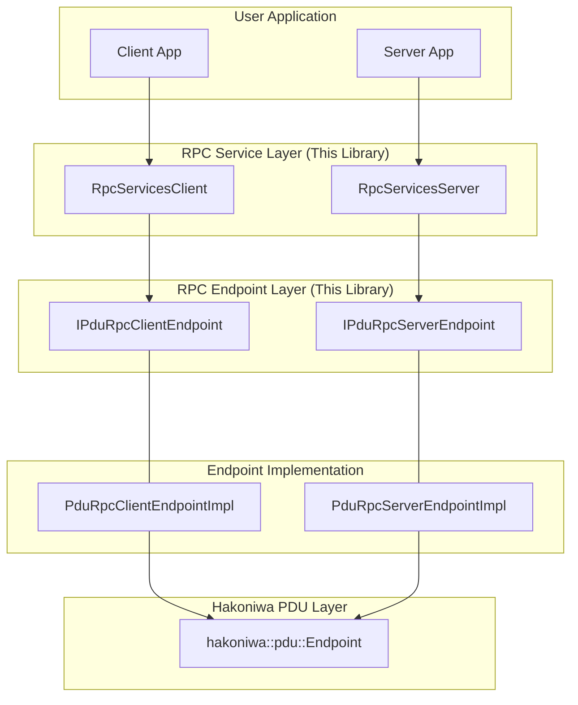

# Hakoniwa PDU-RPC

`hakoniwa-pdu-rpc` is a C++ library that provides a framework for remote procedure calls (RPC) based on Hakoniwa's PDU (Protocol Data Unit) communication.

## 1. How to Build

This project uses CMake.

```bash
# Create a build directory
mkdir build
cd build

# Generate makefiles
cmake ..

# Build the project
make
```

## 2. How to Run Tests

The tests are built along with the project.

```bash
# From the build directory
cd test

# Run the test executable
./hakoniwa_pdu_rpc_test
```

The test executable will automatically change its working directory to find the necessary configuration files.

## 3. Architecture

The library is structured into the following main layers:



### Component Responsibilities

*   **RpcServicesServer / RpcServicesClient (Service Layer)**
    *   Provides the main entry point for user applications.
    *   Manages a collection of RPC services, routing requests from clients to the appropriate service handlers.
    *   Abstracts away the low-level details of communication and PDU formats.

*   **IPduRpcServerEndpoint / IPduRpcClientEndpoint (Endpoint Interface Layer)**
    *   Defines the interface for a single RPC service on the server and client side.
    *   Provides the core RPC operations like `call`, `poll`, `send_reply`.
    *   Decouples the service layer from the concrete transport implementation.

*   **PduRpcServerEndpointImpl / PduRpcClientEndpointImpl (Endpoint Implementation Layer)**
    *   Provides the concrete implementation for the endpoint interfaces.
    *   Handles the logic of sending and receiving PDUs using the underlying `hakoniwa::pdu::Endpoint`.
    *   Manages request IDs, timeouts, and the state of the RPC call.

*   **hakoniwa::pdu::Endpoint (PDU Layer)**
    *   An external component from the `hakoniwa-pdu-endpoint` library.
    *   Handles the actual I/O for sending and receiving PDUs over different transport mechanisms like TCP, UDP, or Shared Memory.

## 4. Design Philosophy

*   **Avoid gRPC**: We chose not to use gRPC to avoid potential build and versioning complexities across different platforms (macOS, Windows, Linux) and to maintain a design that is more native to the Hakoniwa ecosystem.
*   **API Consistency**: The high-level API is designed to be consistent with existing Hakoniwa components, particularly those using shared memory, to minimize the learning curve and integration costs for developers already familiar with Hakoniwa.
*   **Decoupling Control and Data Planes**: The design encourages separating reliable control signals (which are a good fit for this RPC library over TCP) from high-throughput PDU data (which might use UDP or shared memory).
*   **Leverage Existing Assets**: The RPC service definitions (PDUs) are based on existing ROS IDL specifications, allowing for maximum reuse of established data structures.
