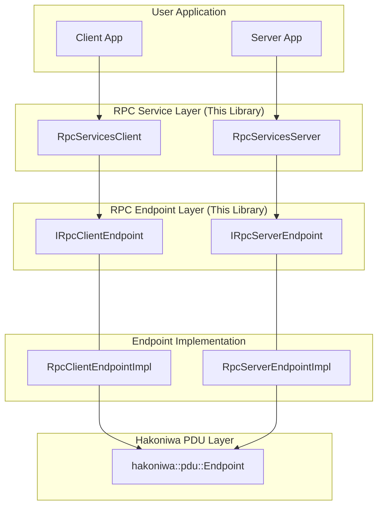

# Hakoniwa PDU-RPC

`hakoniwa-pdu-rpc` is a C++ RPC layer for Hakoniwa built on the PDU communication model.
It provides request/response semantics that align with Hakoniwa endpoint configuration and PDU definitions.
It is intentionally narrow in scope: deterministic integration and explicit topology are prioritized over general-purpose RPC features.
If you are building Hakoniwa-native control-plane RPC in C++, this is the intended layer.

## Positioning (What This Is / Isn't)

**This is:**
- A PDU-native request/response layer for Hakoniwa execution and endpoint semantics.
- A config-driven RPC integration model that reuses Hakoniwa endpoint topology.
- A thin abstraction over `hakoniwa-pdu-endpoint` with explicit call/poll behavior.

**This is not:**
- A general-purpose RPC framework (for example, gRPC).
- A dynamic service mesh with runtime discovery, auth, tracing, and streaming semantics.

Design intent:
- **Explicit semantics:** Request IDs, channels, and timeout behavior are visible in config/API.
- **Config-driven topology:** RPC wiring follows Hakoniwa node/endpoint definitions.
- **Minimal hidden assumptions:** No hidden scheduler/threading policy is imposed by default.
- **API consistency:** Service/client APIs align with existing Endpoint/Bridge usage patterns.

## Links

- Examples: `examples/README.md`
- Tutorial: `docs/tutorials/rpc.md`
- Minimal config set: `config/sample/minimal/README.md`
- JSON schema: `config/schema/service-schema.json`
- Config validator: `PYTHONPATH=python:$PYTHONPATH python -m hakoniwa_pdu_rpc.validate_configs config/sample/simple-service.json --skip-endpoint-validation`

## When To Use / Not Use

| Use when | Not for |
|---|---|
| Hakoniwa ecosystem integration is primary | Polyglot public APIs across many languages |
| Request/response control-plane communication | Web-service style APIs |
| PDU-native data model and transport reuse are required | Streaming RPC workloads |
| Deterministic or tick-driven integration loops are required | Full auth/observability stack requirements |
| C++ applications with existing Hakoniwa config assets | Dynamic service discovery-centric architectures |

## Features

- **Service-Oriented RPC:** Define and manage multiple RPC services within a single server.
- **Multi-Client Support:** A single service can be called by multiple uniquely named clients.
- **Configuration-Driven:** Define services in a JSON file.
- **Typed Helper API:** `HakoRpcServiceServerTemplateType` handles PDU pack/unpack for ROS service types.
- **Transport Agnostic at RPC Layer:** Reuses `hakoniwa-pdu-endpoint` transports (TCP/UDP/Shared Memory) without changing RPC user code.

## Quick Start (5 min)

If you want one working RPC pair first, use the bundled samples.

```bash
# 1) Build examples
cmake -S . -B build \
  -DHAKO_PDU_ENDPOINT_PREFIX=/usr/local/hakoniwa \
  -DHAKO_PDU_RPC_BUILD_EXAMPLES=ON
cmake --build build

# 2) Validate config first (recommended)
PYTHONPATH=python:$PYTHONPATH \
python -m hakoniwa_pdu_rpc.validate_configs config/sample/simple-service.json --skip-endpoint-validation
```

Validation catches schema and RPC consistency errors early (for example: required fields, duplicate names, channel collisions). If endpoint validation is enabled, referenced endpoint config issues are also checked.

Run in two terminals:

```bash
# terminal A
build/examples/hakoniwa_pdu_rpc_server
```

```bash
# terminal B
build/examples/hakoniwa_pdu_rpc_client 1000000
# then type: 5 7
# expected: sum=12
```

If it fails, check these first:
- Server is started before client.
- `nodeId`/client name in config matches what server/client constructors use.
- `endpointId` values match endpoint config mappings.
- Both sides use the same TCP port (`54001`) and reachable addresses.
- Runtime library path includes Hakoniwa libs (`LD_LIBRARY_PATH` or `DYLD_LIBRARY_PATH` as needed).

Reference files used by this path:
- `examples/rpc_server.cpp`
- `examples/rpc_client.cpp`
- `examples/README.md`
- `config/sample/simple-service.json`
- `config/sample/endpoints.json`
- `config/sample/minimal/` (compact equivalent config set)

## Why Config Is Explicit (and Validated)

"Static JSON is brittle" is a valid concern when IDs drift. This repository uses explicit config plus validation to make those failures visible before runtime.

What is validated:
- Service config schema (`config/schema/service-schema.json`).
- RPC-level consistency checks (for example: duplicate service/client names, channel collisions, `maxClients` bounds).
- Optional endpoint validation through `hakoniwa-pdu-endpoint` validator (when installed/available).

Common pitfalls:
- `nodeId` or client name mismatch between code and service config.
- `endpointId` mismatch with endpoint mapping (`endpoints.json`).
- `pduSize` mismatch (base/heap) against generated registry definitions.
- Request/response channel ID collisions.

Explicit config keeps timing, routing, and delivery assumptions reviewable in code review and reproducible in CI.

## Build

### Dependencies

- C++20 compiler (GCC/Clang)
- CMake 3.16+
- Hakoniwa core library (typically under `/usr/local/hakoniwa`)
- Installed `hakoniwa-pdu-endpoint` library and headers

### `hakoniwa-pdu-endpoint` install layout

This project expects:

```text
<prefix>/
  include/hakoniwa/pdu/endpoint.hpp
  lib/libhakoniwa_pdu_endpoint.(a|so|dylib)
```

Default prefix is `/usr/local/hakoniwa`. Override if needed:

```bash
cmake -S . -B build -DHAKO_PDU_ENDPOINT_PREFIX=/path/to/prefix
```

If layout is non-standard, set explicitly:

```bash
cmake -S . -B build \
  -DHAKO_PDU_ENDPOINT_INCLUDE_DIR=/path/to/include \
  -DHAKO_PDU_ENDPOINT_LIBRARY=/path/to/libhakoniwa_pdu_endpoint.so
```

Note: `hakoniwa-pdu-endpoint` depends on Hakoniwa core libs (`assets`, `shakoc`). Ensure library path includes:

```text
/usr/local/hakoniwa/lib
```

### Build steps

```bash
# 1. Configure
cmake -S . -B build \
  -DHAKO_PDU_ENDPOINT_PREFIX=/usr/local/hakoniwa

# 2. Build
cmake --build build
```

Generated library:
- `build/src/libhakoniwa_pdu_rpc.(a|so|dylib)`

### Install

Install headers/libraries/CMake package:

```bash
./build.bash
./install.bash
```

Default install locations:
- Headers: `/usr/local/hakoniwa/include`
- Libraries: `/usr/local/hakoniwa/lib`

Uninstall:

```bash
./uninstall.bash
```

Override install prefix:

```bash
PREFIX=/path/to/prefix ./install.bash
```

### Downstream CMake usage

```cmake
find_package(hakoniwa_pdu_rpc REQUIRED)

add_executable(my_app main.cpp)
target_link_libraries(my_app PRIVATE hakoniwa_pdu_rpc::hakoniwa_pdu_rpc)
```

Note: `hakoniwa-pdu-registry` must be installed and visible on include path because `hakoniwa-pdu-rpc` headers include registry headers.

If installed to non-standard prefix:

```bash
cmake -S . -B build -DCMAKE_PREFIX_PATH=/path/to/prefix
# or
export CMAKE_PREFIX_PATH=/path/to/prefix
```

Build examples:

```bash
cmake -S . -B build -DHAKO_PDU_RPC_BUILD_EXAMPLES=ON
cmake --build build
```

### Hakoniwa core install notes

- Headers: `/usr/local/hakoniwa/include/hakoniwa`
- Libraries: `/usr/local/hakoniwa/lib`
- `hakoniwa-pdu-endpoint` default search prefix: `/usr/local/hakoniwa`
  - Header target: `hakoniwa/pdu/endpoint.hpp`
  - Library target: `libhakoniwa_pdu_endpoint.*`

If shared libraries are not found at runtime, add `LD_LIBRARY_PATH` (Linux) or `DYLD_LIBRARY_PATH` (macOS).

## How To Test

This project uses GoogleTest. After build:

```bash
cd build
make test
# or
ctest
```

## Config Validation Commands

From repository root:

```bash
export PYTHONPATH="python:$PYTHONPATH"
python -m hakoniwa_pdu_rpc.validate_configs config/sample/simple-service.json --skip-endpoint-validation
python -m hakoniwa_pdu_rpc.validate_configs test/configs/service_config.json --skip-endpoint-validation
```

If installed under `/usr/local/hakoniwa`, this also works:

```bash
export PYTHONPATH="/usr/local/hakoniwa/share/hakoniwa-pdu-rpc/python:$PYTHONPATH"
python -m hakoniwa_pdu_rpc.validate_configs config/sample/simple-service.json
python -m hakoniwa_pdu_rpc.validate_configs test/configs/service_config.json
```

Notes:
- Requires `jsonschema` (`pip install jsonschema`).
- Endpoint validator is provided by `hakoniwa-pdu-endpoint`.
- If endpoint schema is not found, set `HAKO_PDU_ENDPOINT_SCHEMA`.
- Use `--skip-endpoint-validation` to skip endpoint-side checks.

## Tutorials and Examples

- `docs/tutorials/rpc.md`: End-to-end RPC setup using sample configs.
- `examples/README.md`: Fastest path to run bundled server/client examples.
- `config/sample/minimal/README.md`: Compact JSON set with field notes.

## Core Concepts

### Services
A service is a remote procedure (for example, `Service/Add`) with request/response PDU definitions and allowed clients.

### Configuration
RPC topology is defined in a service configuration JSON file (`services`).
Endpoint configs are managed separately via `EndpointContainer`; service config references endpoint IDs (`server_endpoints`, `client_endpoint`).

### RPC Service Helper
`HakoRpcServiceServerTemplateType` (for example `HakoRpcServiceServerTemplateType(AddTwoInts)`) provides typed helpers:
- `call()`
- `get_request_body()`
- `reply()`
- `get_response_body()`

This avoids manual byte-level PDU handling in application code.

## API Reference

Primary entry points are `RpcServicesServer` and `RpcServicesClient`.

### `RpcServicesClient`

- `RpcServicesClient(node_id, client_name, config_path, ...)`
  - `node_id`: node ID for this client (must match config)
  - `client_name`: unique client name (must match config)
  - `config_path`: service config path
- `bool initialize_services(endpoint_container)`
- `bool start_all_services()`
- `bool call(service_name, request_pdu, timeout_usec)`
- `ClientEventType poll(service_name, response_out)`

### `RpcServicesServer`

- `RpcServicesServer(node_id, impl_type, config_path, ...)`
  - `node_id`: node ID for this server
- `bool initialize_services(endpoint_container, client_node_id = std::nullopt)`
- `bool start_all_services()`
- `ServerEventType poll(request_out)`
- `void send_reply(header, pdu)`

## Why Polling?

The API uses explicit `poll()` loops by design:
- Integration-friendly for deterministic/tick-driven main loops.
- Avoids hidden threads and timer behavior in the RPC layer.
- Lets applications choose scheduling policy (tight loop, sleep interval, frame/tick alignment).
- Q: Is polling inefficient? A: Polling is explicit for deterministic/tick-driven integration; callers choose their loop and sleep/backoff policy (no hidden threads).

## Most Users Only Need These Entry Points

- `RpcServicesServer` and `RpcServicesClient` for server/client lifecycle and call flow.
- `HakoRpcServiceServerTemplateType` for typed request/response conversion.
- `config/sample/minimal/` as the baseline wiring model.

Endpoint interface layer usage (`IRpcServerEndpoint` / `IRpcClientEndpoint`) is an extension point for custom behavior. Most users can ignore it.

## Why Not gRPC?

This library is not a gRPC replacement; it is a Hakoniwa-native control-plane RPC layer.

- Hakoniwa deployments can face build/versioning constraints across platforms; keeping stack depth lower is operationally simpler.
- PDU-native semantics are first-class here, and transport abstraction is already provided by `hakoniwa-pdu-endpoint`.
- Control-plane RPC and PDU data paths are explicitly separable for deterministic simulation integration concerns.
- Existing ROS IDL + PDU registry assets are reused directly; no additional IDL/runtime stack is required.
- API shape remains consistent with existing Hakoniwa Endpoint/Bridge usage patterns.

If you need polyglot clients, streaming, auth, or tracing, gRPC is a better fit.
A hybrid approach is also valid: use gRPC for the control-plane and keep Hakoniwa PDU for the data-plane.
Trade-off of the hybrid:
- Two independent middleware stacks (build, dependencies, lifecycle).
- Two debugging toolchains and mental models.
- Integration drift between RPC semantics and Hakoniwa-native topology/config.
This is a deliberate trade-off: broader RPC features are traded for reproducibility and tight Hakoniwa-native integration.

## Configuration File Schema

Service configuration example:

```json
{
  "pduMetaDataSize": 24,
  "services": [
    {
      "name": "Service/Add",
      "type": "hako_srv_msgs/AddTwoInts",
      "maxClients": 1,
      "pduSize": {
        "server": { "heapSize": 0, "baseSize": 296 },
        "client": { "heapSize": 0, "baseSize": 288 }
      },
      "server_endpoints": [
        {
          "nodeId": "server_node",
          "endpointId": "server_ep_id"
        }
      ],
      "clients": [
        {
          "name": "TestClient",
          "requestChannelId": 1,
          "responseChannelId": 2,
          "client_endpoint": {
            "nodeId": "client_node",
            "endpointId": "client_ep_id"
          }
        }
      ]
    }
  ]
}
```

Key fields:
- `pduMetaDataSize`: metadata header size.
- `services`: service definitions.
  - `name`: unique service name.
  - `type`: ROS service type (for example `hako_srv_msgs/AddTwoInts`).
  - `pduSize`: base/heap PDU sizes for server/client.
  - `server_endpoints`: server endpoint mappings.
  - `clients`: allowed clients and channel mappings.

## Architecture



Layer responsibilities:
- `RpcServicesServer` / `RpcServicesClient`: primary application entry points.
- `IRpcServerEndpoint` / `IRpcClientEndpoint`: extension interfaces.
- `RpcServerEndpointImpl` / `RpcClientEndpointImpl`: default endpoint implementations.
- `hakoniwa::pdu::Endpoint`: underlying transport/data-plane interface.
